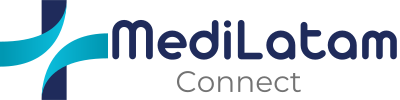

# c17-49-n-java




## Descripción 
La aplicación de telemedicina permite a los pacientes tener consultas médicas mediante video llamadas y otros medios de comunicación, todo desde la comodidad de sus hogares. Los médicos pueden acceder a la historia clínica del paciente durante la consulta, mientras que el personal administrativo del centro médico puede gestionar las reuniones y otras funciones de la aplicación.

## Características Principales ✨
- Consultas virtuales con médicos desde cualquier parte del mundo.
- Acceso a la historia clínica del paciente durante la consulta.
- Gestión de reuniones y otros aspectos administrativos por parte del personal médico.

## Instalación 🚀
Para instalar la aplicación en modo desarrollo, ejecuta los siguientes comandos:

```bash
npm install
npm run dev
```
```bash
npm install
npm run build
```
```bash
   aqui los comandos para el backend java.....
```

Asegúrate de instalar todas las dependencias antes de ejecutar los comandos anteriores.

## Capturas de Pantalla 📷

¡Aquí van algunas capturas de pantalla de la aplicación en acción! (Agrega las imágenes aquí)

## Integrantes del Equipo 🙍‍♂️
### Team Leader:
- Leonela Denise Dominguez Almada
### Back-end:
- Andrés Orozco
- Anthony Medina García
- Esteban Camacho Salgado
- Franco Quijada
- Marcos Aguilar
- Christian Pérez
- Fernando Garcia
 ### QA:
- Nicolas Sole
 ### Front-End:
- Anderson Jiménez
- Wilder chambi
- Alexis Jardin
  
  [](https://github.com/No-Country/c17-49-n-java/graphs/contributors)

## Tecnologías Utilizadas 🧰

- Backend: Java con Spring Boot y base de datos MySQL.
  
    
    
  
- Frontend: Next.js y Tailwind CSS.

    
    

## Contribuir al proyecto 🛠️
Si tienes alguna sugerencia que podría mejorar el proyecto, por favor haz un [_fork_](https://github.com/No-Country/c17-49-n-java/fork) del repositorio y crea una [_pull request_](https://github.com/No-Country/c17-49-n-java/pulls). También puedes simplemente abrir un [_issue_](https://github.com/No-Country/c17-49-n-java/issues) con la etiqueta "mejora".

Aquí tienes una guía rápida:

1. Haz un [_fork_](https://github.com/No-Country/c17-49-n-java/fork) del Proyecto
2. Clona tu [_fork_](https://github.com/No-Country/c17-49-n-java/fork) (`git clone <URL del fork>`)
3. Añade el repositorio original como remoto (`git remote add upstream <URL del repositorio original>`)
4. Crea tu Rama de Funcionalidad (`git switch -c feature/Nueva Caracteristica`)
5. Realiza tus Cambios (`git commit -m 'Add: nueva Funcionalidad'`)
6. Haz Push a la Rama (`git push origin feature/Caracteristica`)
7. Abre una [_pull request_](https://github.com/No-Country/c17-49-n-java/pulls)

## Agradecimientos

Queremos agradecer especialmente a No Country por la oportunidad de participar en la creación de este proyecto.


